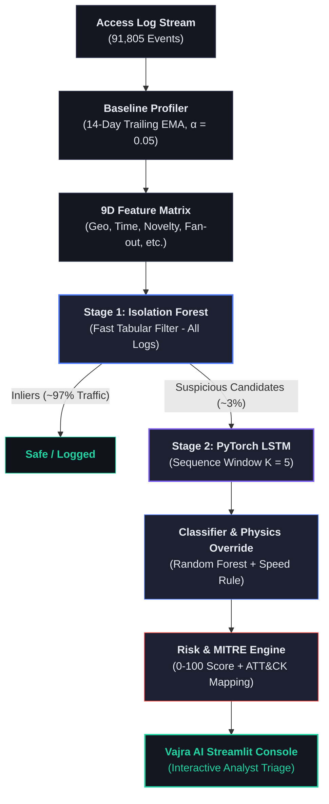

# Vajra AI — Cascaded Behavioral Threat Detection & Response

> **Notice for Reviewers**: Data and trained models are **already included** in this repository (`data/*.csv` and `models/saved/*`). You do **NOT** need to generate datasets or train models from scratch to run the live dashboard.

---

## 🚀 Live Demo

**Try it now in your browser — no installation required:**  
👉 **[https://vajra-ai.streamlit.app/](https://vajra-ai.streamlit.app/)**

> **Note**: The app may take 30–60 seconds to spin up on your first visit if it has been idle (Streamlit Community Cloud free tier automatically sleeps inactive apps).

---

## 🛠️ Before You Start (Prerequisites)

If you have never run a code project on your computer before, don't worry! You only need two free, standard software tools installed:

1. **Python** (version 3.10 or newer): [Download Python from python.org](https://www.python.org/downloads/)  
   *(Windows users: during installation, make sure to check the box that says **"Add python.exe to PATH"**).*
2. **Git**: [Download Git from git-scm.com](https://git-scm.com/downloads)

### 💻 Opening Your Terminal
A **terminal** (or command prompt) is a plain-text window where you type simple commands to instruct your computer to run software.
- **Windows**: Press the `Windows Key`, type `Command Prompt` (or `PowerShell`), and press `Enter`.
- **Mac**: Press `Cmd + Space` to open Spotlight, type `Terminal`, and press `Enter`.

---

## ⚡ Quick Start — Step-by-Step Guide

Follow these numbered steps in your terminal. Copy and paste each command exactly as shown.

### Step 1: Download the Project to Your Computer
Open your terminal and run:
```bash
git clone https://github.com/BHAVYA15-lab/Vajra-AI.git
```
*What this does:* Downloads a copy of the Vajra AI repository directly onto your computer.

### Step 2: Open the Project Folder
```bash
cd Vajra-AI
```
*What this does:* Navigates your terminal into the project directory so subsequent commands run inside this folder.

### Step 3: Create an Isolated Virtual Environment
- **Windows**:
  ```cmd
  python -m venv venv
  ```
- **Mac / Linux**:
  ```bash
  python3 -m venv venv
  ```
*What this does:* Creates a private, isolated folder named `venv` where all project dependencies will be stored safely without interfering with other software on your computer.

### Step 4: Activate the Virtual Environment
- **Windows (Command Prompt / PowerShell)**:
  ```cmd
  .\venv\Scripts\activate
  ```
- **Mac / Linux**:
  ```bash
  source venv/bin/activate
  ```
*What this does:* Tells your terminal to use the tools and packages inside the `venv` folder. You will see `(venv)` appear at the start of your terminal line confirming it is active.

### Step 5: Install Project Dependencies
```bash
pip install -r requirements.txt
```
*What this does:* Installs all required libraries (such as Streamlit, PyTorch, Scikit-Learn, and Pandas). This step may take 1–3 minutes depending on your internet connection. That is completely normal! If it pauses, let it complete.

### Step 6: Launch the Interactive SOC Dashboard
```bash
python -m streamlit run Home.py
```
*What this does:* Starts the local web server and compiles the Vajra AI application.

### 🌐 What to Expect
A new tab will automatically open in your default web browser at **`http://localhost:8501`** displaying the live **Vajra AI SOC Security Console**.  
*(If the browser tab does not open automatically, simply open your browser and type `http://localhost:8501` into the address bar).*

---

## 🔧 Troubleshooting Guide for Beginners

- **`"command not found: python"` or `"python is not recognized"`**:
  Python is either not installed or was not added to your system's environment variables. Re-run the Python installer from [python.org](https://www.python.org/downloads/), select **Modify**, and make sure **"Add Python to PATH"** is checked.
- **`"command not found: git"`**:
  Git is not installed yet. Download and install it from [git-scm.com](https://git-scm.com/downloads), then restart your terminal.
- **What if `pip install` fails or gets interrupted partway?**:
  It is 100% safe to re-run `pip install -r requirements.txt` again. `pip` will skip packages already downloaded and finish installing the rest.
- **How to stop the dashboard app**:
  Click inside your terminal window and press **`Ctrl + C`**. This safely shuts down the local web server.
- **How to restart the app later**:
  You do **NOT** need to re-download or reinstall anything! Whenever you want to open the dashboard again in the future, just open your terminal, navigate to the folder (`cd Vajra-AI`), activate the environment (`.\venv\Scripts\activate` or `source venv/bin/activate`), and run `python -m streamlit run Home.py`.

---

## 📊 Dashboard Walkthrough — What You'll See

When you open the dashboard at `http://localhost:8501`, use the left sidebar menu to navigate between 4 interactive pages:

### 1. 🏠 Home Page (`Home.py`)
- **Executive System Overview**: Serves as the central mission-control dashboard for security managers.
- **4 Top-Line Stat Cards**: Displays total events monitored (`91,805`), total entities profiled (`175`), overall alert rate (`3.20%`), and top 1% alert budget recall (`75.6%`).
- **Actionable Feature Leaderboard**: Ranks which behavioral anomaly features (e.g. geographic distance, auth failure bursts) most frequently drive high-risk classifications, complete with tailored SOC remediation recommendations.

### 2. 🚨 Live Threat Feed (`pages/1_Live_Threat_Feed.py`)
- **Real-Time SOC Triage Queue**: The main workstation where security analysts monitor and investigate incoming security alerts.
- **Filter Bar & Cold-Start Toggle**: Instantly filter alerts by entity type (User, Service Account, Edge Device), risk level (Critical, High, Medium, Low), attack category, or search by IP/Entity ID. Check **"Cold-Start Only ❄️"** to focus on new entities with no prior history.
- **🔴 LIVE Monitoring Mode**: Simulates real-time log ingestion by streaming events progressively (25 logs per tick) with play/pause/reset controls, mimicking a live SIEM event feed.
- **Risk Score vs. Confidence Score**: Clear visual separation between **Risk Score** (0–100 score indicating *how severe/damaging the threat would be if real*) and **Confidence Score** (0–100% score indicating *how certain the machine learning model is in its classification*).
- **MITRE ATT&CK Mapping & Explanation Summaries**: Maps every alert to an official industry-standard attack catalog ID (e.g. `T1110` for Brute Force) and provides plain-English summaries (e.g. *"Resource novelty: 82%"* or *"Off-hours login"*) instead of mysterious scores.
- **Triage Inspector & Analyst Feedback**: Clicking any alert opens an in-depth panel showing feature attributions, recent activity sequence timeline (K = 5), speed rule details, and interactive **"Confirm Threat ✅"** / **"Dismiss False Positive ❌"** buttons that log analyst feedback.

### 3. 👤 Entity Profiler (`pages/2_Entity_Profiler.py`)
- **Entity Behavioral Baseline View**: Allows analysts to inspect what "normal" behavior looks like for any specific user, service account, or device over a trailing 14-day window.
- **Peak Login Hour Distribution**: Displays a smooth Gaussian curve of when the entity normally logs in during the day.
- **Resource Access Probabilities**: Shows a bar chart of the entity's top historically accessed internal servers, databases, and APIs.
- **Concept Drift Inspector**: Displays an overlaid dual-histogram comparing an entity's early baseline against their evolved recent behavior, visually demonstrating how exponential decay (α = 0.05) adapts to legitimate role/schedule changes over time without raising false alarms.

### 4. 📊 Threat Analytics (`pages/3_Threat_Analytics.py`)
- **Cascade Stage Benchmarks**: Provides performance metrics comparing **Stage 1 (Isolation Forest)** (fast tabular screening filter) against **Stage 2 (PyTorch LSTM)** (deep sequence validator).
- **Alert Budget Trade-Off Table**: Explains realistic SOC operational capacity—since human analysts can only review a fixed number of alerts per shift, this panel shows exact trade-offs between alert capacity, true attack recall, and false positive rates.
- **Inference Latency Comparison**: Bar chart comparing fast tabular screening (< 1.0 ms) against deep sequence evaluation (4.5 ms), visually demonstrating the **96.88% compute workload reduction**.
- **Risk Score Spread Box Plot**: Interactive distribution plot showing risk score ranges across different attack types (`brute_force`, `credential_stuffing`, `impossible_travel`, etc.).

---

## 💡 Executive Summary & Solution Pitch

**Vajra AI** is a domain-agnostic behavioral threat detection platform designed to solve modern Security Operations Center (SOC) alert fatigue. Rather than relying on rigid, easily-evaded IP blacklists or signature keywords, Vajra AI models normal access behavior per entity (users, service accounts, edge devices) over trailing 14-day windows. By combining high-throughput tabular filtering with deep sequence validation in a **two-stage cascade architecture**, the platform catches living-off-the-land intrusions in real time while reducing deep learning compute workloads by **96.88%**. Detected anomalies are mapped directly to official MITRE ATT&CK techniques and presented via an interactive, human-in-the-loop Streamlit SOC console.

---

## 🌟 Key Technical Highlights

- **⚡ Two-Stage Cascade Architecture (96.88% Workload Reduction)**:
  - **Stage 1 (Isolation Forest)**: Rapidly screens 100% of incoming session traffic in < 1.0 ms per event across 9 engineered baseline-deviation features.
  - **Stage 2 (PyTorch LSTM Autoencoder)**: Evaluated *only* on suspicious candidates flagged by Stage 1 (~3% of traffic), validating temporal multi-session sequence patterns (K = 5) while cutting deep learning inference overhead by 96.88%.

- **📅 Strict Temporal Train/Test Evaluation (Zero Behavioral Leakage)**:
  Evaluated on a strict chronological split (**Training = Days 1–21 [64,250 logs]**, **Testing = Days 22–30 [27,555 logs]**). Training baseline profilers and models operate exclusively on past logs, preserving true concept-drift evaluation integrity without future context leakage.

- **🎯 Operational Alert-Budget Tuning**:
  Evaluates recall against realistic SOC analyst review capacity rather than uncalibrated static thresholds. At the **Top 1.0% Alert Budget Capacity** (276 alerts / 27,555 test logs), the system achieves **75.61% Recall** (31/41 attacks captured) at a **0.89% False Positive Rate**.

- **🔎 Transparent & Honest Engineering Documentation**:
  Explicitly documents system edge cases—including **Asset Severity Bias** (where composite risk scoring intentionally prioritizes high-value asset risk over low-value asset attacks) and **Base-Rate Precision Trade-Offs** (explaining how a 0.89% FPR yields 11.23% precision given a 0.15% attack prevalence).

- **✈️ Hybrid Physics + ML Engine**:
  Governs geometrically verifiable facts with a deterministic Haversine speed rule (V > 900 km/h) to flag `impossible_travel` with 100% precision and recall, while delegating statistical behavioral patterns to a multi-class Random Forest (`class_weight='balanced'`).

- **🛡️ MITRE ATT&CK Mapping & Actionable Triage**:
  Automates mapping of all threat categories to official MITRE Technique IDs (`T1110`, `T1036`, `T1078`, `T1021`, `T1041`) paired with step-by-step SOC remediation guidance.

---

## 🏗️ System Architecture & Pipeline Flow



---

## 🔬 Advanced: Regenerating Data & Models From Scratch

If you wish to re-generate synthetic access logs or re-train models from scratch:

```bash
# 1. Generate Synthetic Access Log Dataset (91,805 logs, 175 entities)
python data_generator/generate_logs.py

# 2. Fit Baseline Profiler & Train Cascade Models (Isolation Forest & PyTorch LSTM)
python models/detection_model.py

# 3. Train Multi-Class Threat Classifier (Random Forest with class_weight='balanced')
python models/classifier.py

# 4. Generate Sample SOC Analyst Explainability Reports
python explainability/explainer.py

# 5. Launch SOC Dashboard
python -m streamlit run Home.py
```

---

## 📂 Repository Structure

```
.
├── Home.py                     # Main Streamlit SOC Dashboard Entrypoint
├── pages/
│   ├── 1_Live_Threat_Feed.py   # Live Threat Stream, 🔴 LIVE Mode, Cold-Start Toggle, Triage Inspector
│   ├── 2_Entity_Profiler.py    # Entity Baseline Profiler & Concept Drift Inspector
│   └── 3_Threat_Analytics.py   # Cascade Stage Benchmarks & Alert Budget Analysis
├── models/
│   ├── baseline_profile.py     # Trailing 14-day EMA Profiler & Cold-Start Peer Fallback
│   ├── detection_model.py      # Stage 1 Isolation Forest & Stage 2 PyTorch LSTM Autoencoder
│   └── classifier.py           # Multi-Class Balanced Random Forest Threat Classifier
├── explainability/
│   ├── explainer.py            # SHAP Feature Attributions, 0-100 Risk Engine & Triage Cards
│   └── mitre_mapping.py        # MITRE ATT&CK Technique Mapping & SOC Remediation Guidance
├── utils/
│   ├── data_loader.py          # Vectorized Pipeline Data Loader & Analyst Feedback Logging
│   └── theme.py               # Dark Glassmorphic Design System & Visual Tokens
├── data_generator/
│   └── generate_logs.py        # Synthetic Access Log Stream Generator (91,805 events)
├── reports/
│   ├── report.md               # Comprehensive Technical & Architectural Report
│   ├── benchmark_limitation.md # Synthetic Separability & Low-Sample Evaluation Caveats
│   ├── project_summary.md      # High-Level Architecture & Benchmark Summary
│   └── PPT_SOURCE_CONTENT.md   # 6-Slide Hackathon Presentation Source Content
├── data/
│   ├── access_logs.csv        # Pre-generated access logs (91,805 events)
│   └── ground_truth_labels.csv # Ground-truth attack labels
├── models/saved/              # Serialized trained model checkpoints
└── requirements.txt            # Python Dependencies
```

---

## ⚠️ Known Limitations & Real-World Considerations

- **Ephemeral Cloud Feedback Persistence**: Analyst feedback recorded via the **Confirm Threat ✅** and **Dismiss False Positive ❌** buttons is logged to a local CSV (`data/analyst_feedback.csv`). When deployed on hosted platforms like Streamlit Community Cloud, this file resides on an ephemeral filesystem and will not persist across app restarts or container redeployments (it operates normally and persists permanently when run locally on your own machine).
- **Stage 1 Recall Ceiling**: Because the detection pipeline is a cascade, Stage 1 (Isolation Forest) sets the recall ceiling for the system. Stage 2 (LSTM) serves to suppress false positives and reduce compute workloads rather than recover Stage 1 misses.
- **Asset Severity Bias**: Composite Risk Score ranking incorporates a 25% asset criticality weight (`SeverityWeight`), which intentionally deprioritizes low-value asset attacks (`severity_weight = 0.30`) below high-value normal traffic. Raw unweighted anomaly ranking surfaces all low-asset attacks (100% recall at 10% budget).
- **Synthetic Benchmark Separability**: Synthetic anomaly injection patterns (abrupt geographic jumps, auth failure bursts) are cleanly separable by construction. Real-world zero-day performance would require tuning against live traffic distributions.
- **Untested Physics Borderline Range**: The speed check (V > 900 km/h) was evaluated against extreme synthetic jumps (> 50,000 km/h). Realistic flight layover velocities (900 to 5,000 km/h) require real-world travel data tuning before production deployment.
